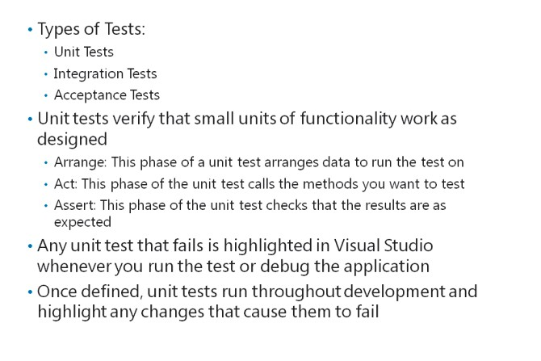
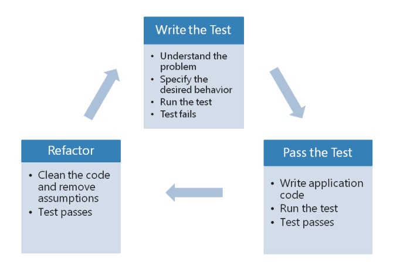
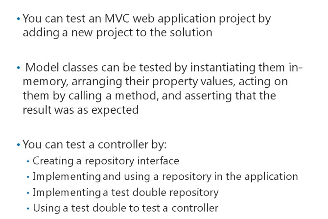
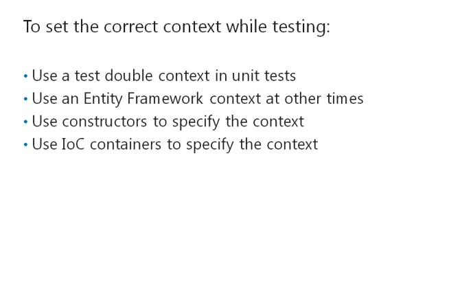
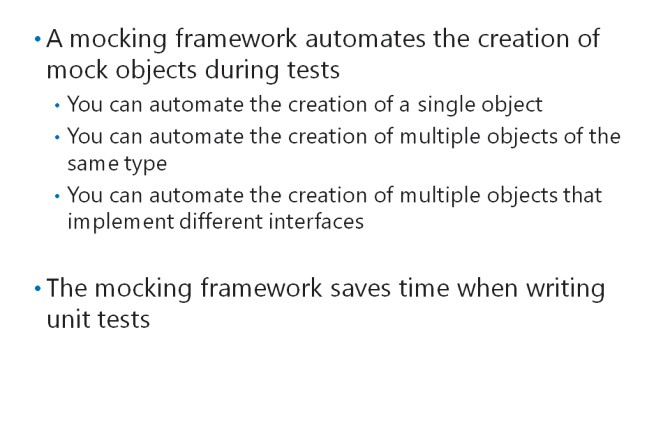

# Module 06 <br> Testing and Debugging ASP.NET MVC 5 Web Applications

#### Contents:

[Module Overview](06-0.md)    
[**Lesson 1:** Unit Testing MVC Components](06-1.md)    
[**Lesson 2:** Implementing an Exception Handling Strategy](06-2.md)    

## <a name="2"></a>Lesson 1 <br> **Unit Testing MVC Components**

A unit test is a procedure that instantiates a component that you have written, calls one aspect of the functionalities of the component, and checks that the component responds correctly according to the design. In object-oriented programming, unit tests usually instantiate a class and call one of its methods. In an MVC web application, unit tests can instantiate model classes or controllers and call their methods and actions. As a web developer, you need to know how to create a testing project and add tests to the testing project. The tests check individual aspects of your code without relying on database servers, network connections, and other infrastructure. This is because unit tests focus on the code you write.

### Lesson Objectives

After completing this lesson, you will be able to:

- Describe the use of unit tests to improve the quality of code you write.

- List the principles of Test Driven Development (TDD).

- Describe how loosely-coupled components increase the testability and maintainability of your application.

- Write unit tests against model classes, controllers, and views in an MVC web application.

- Describe how Inversion of Control (IoC) containers can instantiate controllers and model classes.

- Run unit tests in Visual Studio 2015.

- Use a mocking tool to automate mock creation in unit tests.

### Why Perform UnitTests?



There are three types of tests you can use to identify bugs in your application:

- _Unit Tests:_ Unit tests check small aspects of functionality. For example, a unit test may verify the return type of a single method. By defining many unit tests for your project, you can ensure they cover all functional aspects of your web application.

- _Integration Tests:_ Integration tests check how two or more components work together. They can be used to check how two or more classes interact with each other. Integration tests can also be used to check how the entire web application, including the database and external web services, works to deliver content.

- _Acceptance Tests:_ Acceptance tests focus on a functional or technical requirement that must work for the stakeholders to accept the application. Similar to integration tests, acceptance tests usually test multiple components working together.

**Note:** Unit tests are important because they can be defined early in development. Integration and acceptance tests are usually run later, when several components are approaching completion.

**What Is a Unit Test?**

A unit test is a procedure that verifies a specific aspect of functionality. Multiple unit tests can be performed for a single class and even for a single method in a class. For example, you can write a test that checks that the **Validate** method always returns a Boolean value. You might write a second test that checks that when you send a string to the **Validate** method, the method returns a **true** value. You can assemble many unit tests into a single class called a test fixture. Often, a test fixture contains all the tests for a specific class. For example, **ProductTestsFixture** may include all tests that check methods in the **Product** class.

A single unit test usually consists of code that runs in three phases:

1. _Arrange_. In this phase, the test creates an instance of the class that it will test. It also assigns any required properties and creates any required objects to complete the test. Only properties and objects that are essential to the test are created.

2. _Act_. In this phase, the test runs the functionality that it must check. Usually, in the Act phase, the test calls a single procedure and stores the result in a variable.

3. _Assert_. In this phase, the test checks the result against the expected result. If the result matches what was expected, the test passes. Otherwise, the test fails.

**How Do Unit Test Help Diagnose Bugs?**

Because unit tests check a small and specific aspect of code, it is easy to diagnose the problem when the tests fail. Unit tests usually work with a single class and isolate the class from other classes wherever possible. If other classes are essential, the smallest number of classes are created in the Arrange phase. This approach enables you to fix issues rapidly because the number of potential sources of a bug is small.

Unit tests should check the code that you write and not any infrastructure that the production system will rely on. For example, unit tests should run without connecting to a real database or web service because network problems or service outages may cause a failure. Using this approach, you can distinguish bugs that arise from code, which must be fixed by altering code, from the bugs that arise from infrastructure failures, which must be fixed by changing hardware, reconfiguring web servers, reconfiguring connection strings, or making other configuration changes.

**Automated Unit Testing**

It is important to understand that unit tests, after they are defined, can be rerun quickly and easily throughout the rest of the project life cycle. In fact, Microsoft Visual Studio reruns tests automatically whenever you run a project with debugging. You can also manually initiate tests any time.

This is important because new code can cause bugs at any stage of the development process. As an example, consider a project that proceeds through three phases. A unit test defined for phase 1 helps highlight problems in phases 2 and 3 that might otherwise go unnoticed:

1. _Phase 1_. The **ProductController** class is defined and the **Test_Index_Action** unit test is written. The test checks that the **Index** action works with an integer parameter. When you call the **Index** action with an integer, the action returns a collection that includes the same number of **Product** objects. The test passes.

2. _Phase 2_. A developer modifies the **Index** action so that it returns a partial view. The developer renames the action **\_Index** to conform to the teams partial view naming convention. The test fails because the name has changed. The developer modifies the test so that it calls the renamed action and the test passes.

3. _Phase 3_. A developer modifies the **Index** action by writing a different Language Integrated Query (LINQ) to implement a new functional requirement. However, the developer makes a mistake in the LINQ syntax. The **Index** action now returns zero products regardless of the integer that is passed as a parameter. The test fails.

In Phase 2, the test failure arose because the action name had changed, not because of a mistake in the action code. The solution was to change the name of the action called in the test method, but this can remind developers to alter calls to renamed actions throughout the solution.

In Phase 3, the test failure arose because the developer misunderstood LINQ or made a typing error in the LINQ syntax. The unit test highlighted the error as soon as it arose. This helps the developer focus on a solution to resolve the test failure and ensure that new functionality does not cause failures in code written earlier in the project.

**Question**: Board members want you to ensure that your web application correctly calculates sales tax on every product in the catalog. Is this an example of a unit test, an integration test, or an acceptance test?

### Principles of Test Driven Development



You can use unit tests in any development methodology, including waterfall projects, iterative projects, and Agile projects to spot potential bugs and improve the quality of the final application. Any project can benefit from unit testing, regardless of the development methodology used in the project. However, a specific development methodology, called Test Driven Development (TDD), places unit testing at the center of working practices. TDD is often described as a separate development methodology. Some authors consider it to be a core principle of the Extreme Programming methodology.

#### **Write the Test, Pass the Test, Refactor**

In TDD, developers repeat the following short cycle to implement a functional requirement:

1. _Write the Test_. The developer starts by creating and coding the unit test. This step requires a full understanding of the functional requirement, which can be obtained from use cases or user stories. Because the developer has not written any code in the application, the test fails.

2. _Pass the Test_. The developer writes some quick and simple code in the application so that it passes the test. During the first iteration, this code is frequently inelegant and may include false assumptions such as hardcoded values.

3. _Refactor_. The developer cleans up the application code, removes duplicate code, removes hardcoded values, improves readability, and makes other technical improvements. The developer reruns the test to ensure that refactoring has not caused a failure.

The cycle is then repeated. In each iteration, the developer adds a small new element of the final functionality with a corresponding test.

It is important that the code in your tests is treated as production code. It should be well thought out and easy to read so that other developers can understand the test and quickly diagnose any test failures.

#### **Test Driven Development Principles**

TDD is different from traditional approaches to application development. To use TDD effectively, you must understand its fundamental principles:

- _Write tests before code_. In the TDD development cycle, the test is created in step one before any code in the application. This means the test must fail the first time it is run. You can understand the test as a specification for the functionality you are building. By writing the test first, you ensure that you begin with a thorough understanding of the problem you are trying to solve.

- _Move in small steps_. By breaking a large application down into small elements of functionality, you can improve developer productivity. You can do this by giving a developer a small problem to solve in each iteration. The developer can solve the simple problem quickly and understand all the possible circumstances in which their code runs.

- _Only write enough code to pass the test_. In each iteration, do not be tempted to add extra code that is not related to the test. For example, if you know that users will call an action with other parameters than the ones in the test, do not write code to handle these parameters. Instead, during the next iteration, write a second test for those parameters. Then write and refactor that code.

Developers can refer to tests as examples of how to use a class or method. This can increase developer productivity because developers can view the code that demonstrates the method or class.

**Note:** In the lab, you will use some TDD principals as you develop the solution. However, the lab does not conform to a strict reading of the TDD methods.

**Question:** You have written a controller for the **Comment** model class. You write a unit test that checks that the **Index** action returns a collection of **Comment** objects. Have you conformed to TDD principles?

### Writing Loosely Coupled MVC Components


A loosely coupled application is one in which each component requires few or no details of the other components of the system. In object-oriented programming, for example, two classes can be described as loosely-coupled if one class can call methods on the other class without any code that is specific to the other class. When system components are loosely-coupled in this manner, it is easy to replace a class with another implementation of the same functionality. Loosely coupled components are essential for thorough unit testing because classes that deal with real data, such as data from a database, can be easily be replaced with classes that deal with test data.

#### **Using Loose Coupling in Tests**

A loosely-coupled application is easy to test because you can make tests simpler by replacing a fully functional instance of a class with a simplified instance that is specifically designed for the test. Replacing classes in tests in this manner can only be done when components are loosely coupled. Replacement instances used for unit tests are known as test doubles or fakes. A test double or fake includes just enough code and properties to pass the relevant test and prove the functionality.

#### **Other Benefits of Loose Coupling**

Loose coupling has other benefits besides testing. Loose coupling makes it easier to replace simple components with more sophisticated onesfor example, in version one of an application you might write a class that calculates a simple arithmetical mean. In version two, you might replace this class with a new class that calculates a weighted mean based on a more complex algorithm. If the components are loosely coupled, you can perform this replacement without modifying any code outside of the averaging classes.

#### **Using Interfaces for Loose Coupling**

In object-oriented programming, an interface defines a set of properties and methods. Any class that implements that interface must implement all the properties and methods it defines as a minimum. This creates loose coupling because you need not specify a class in code. Instead, you can specify any implementation of a particular interface.

#### **Loose Coupling in an MVC Web Application**

To show how loose coupling can be used in an MVC web application, consider the following scenario:

You are writing an MVC web application that displays a product catalog and enables users to click a product to view the full details. On the product details page, users can view and add reviews of that product. You want to ensure during testing that the **Product.Reviews** property, which is a collection of **Review** objects, only includes reviews with the right **ProductID** value.

Recall that unit tests should not rely on infrastructure such as network connections or database servers, but only on test code. By contrast, in production, the application will obtain all product reviews from a database. To satisfy the needs of testing and production, you can build the following components:

- An **IProduct** interface. This includes a definition of the **Reviews** property, together with other properties and methods. This interface is known as a repository.

- A **Product** class. This is the implementation of the **IProduct** repository that the application uses in production. When the user calls the **Reviews** property, all the reviews for the current product are obtained from the database.

- A **TestProduct** class. This is the test double or fake implementation of the **IProduct** repository that the test uses. The test sets up a **TestProduct** object and fake reviews with different **ProductID** values. The test calls the **TestProduct.Reviews** property and checks that only the right reviews are returned.

Notice that, in the test, the **TestProduct** double uses in-memory data set up during the _Arrange_ phase. It does not query the database. Therefore, you can test your code without relying on the network connection to the database or the database server itself. This approach also ensures that the test runs quickly, which is important because slow tests discourage developers from running tests regularly.

**Question:** In a test, you create a fake collection of **BlogEntry** objects. Is this an example of an interface or a test double?

### Writing Unit Tests for MVC Components



The Microsoft ASP.NET MVC 5 programming model is easy to integrate with the principles of unit testing and TDD because of its separation of concerns into model, controllers, and views.

Models are simple to test because they are independent classes that you can instantiate and configure during the Arrange phase of a test.

Controllers are simple classes that you can test, but it is complex to test controllers with in- memory data, rather than using a database. To test controllers with in-memory data, you create a test double class, also known as a fake repository.

Objects of this class can be populated with test data in memory without querying a database. You need to understand how to write test doubles and how to write a typical test for MVC classes.

#### **Add and Configure a Test Project**

In Microsoft Visual Studio 2015, you can test an MVC web application project by adding a new project to the solution, based on the **Unit Test Project** template. You must add references to the test project so that test code can access classes in the MVC web application project. You will also need a reference to **System.Web.Mvc** and other namespaces from the Microsoft .NET Framework.

In a Visual Studio test project, test fixtures are classes marked with the **[TestClass]** annotation. Unit tests are methods marked with the **[TestMethod]** annotation. Unit tests usually return **void** but call a method of the **Assert** class, such as **Assert.AreEqual()** to check results in the test Assert phase.

**Note:** There are many other test frameworks available for MVC web applications and you can choose the one you prefer. Many of these frameworks can be added by using the NuGet package manager available in Visual Studio. If you use Visual Studio Express, you cannot use the Visual Studio **Unit Test Project** template, but you can add other testing frameworks by using NuGet.

#### **Test Model Classes and Business Logic**

In MVC, model classes do not depend on other components or infrastructure. You can easily instantiate them in-memory, arrange their property values, act on them by calling a method, and assert that the result was as expected. Sometimes, you create business logic in the model classes, in which case the _Act_ phase involves calling a method on the model class itself. If, by contrast, you have created a separate business logic layer, code in the _Act_phase must call a method on the business object class and pass a model class.

The code in this test creates an instance of the **Product** model class and sets its **Type** property. The test checks that in these circumstances, the **GetAccessories()** method returns a collection of **BikeAccessory** objects.

**Testing a Model Class**

``` cs
[TestMethod] 
public void Test_Product_Reviews() 
{    
  //Arrange phase    
  Product testProduct = new Product();    
  testProduct.Type = "CompleteBike";    
  //Act phase    
  var result = testProduct.GetAccessories();
  //Assert phase    
  Assert.AreEqual(typeof(IEnumerable(BikeAccessory)), result.GetType());
} 
```

#### **Create Repository Interfaces**

A repository is an interface that defines properties and methods that MVC can use to store data in a web application. It is common to create a single repository interface for your entire web application.

In the following code example, the **IWebStoreContext** interface is a repository that defines methods such as **Add()** and **Delete()**, and properties such as **Products**.

**A Repository Interface**

``` cs
public interface IWebStoreContext 
{    
  IQueryable<Product> Products { get; }    
  T Add<T>(T entity) where T : class;    
  Product FindProductById(int ID);    
  T Delete<T>(T entity) where T : class; 
}
```

#### **Implement and Use a Repository in the Application**

The repository interface defines methods for interacting with data but does not fix how that data will be set and stored. You must provide two implementations of the repository:

- An implementation of the repository for use in production and development. This implementation will use data from the database or some other storage mechanism.

- An implementation of the repository for use in tests. This implementation will use data from the memory set during the Arrange phase of each test.

The following code example shows how to implement the repository interface in your MVC project for use in production and development.

**Implementing a Repository in the MVC Project**

``` cs
public class WebStoreContext : DbContext, IWebStoreContext 
{    
  public DbSet<Product> Products { get; set; }    
  IQueryable<Product> IWebStoreContext.Products 
  { 
    get { return Photos; } 
  }    
  T IWebStoreContext.Add<T>(T entity)    
  {       
    return Set<T>().Add(entity);    
  }    
  Product IWebStoreContext.FindProductById(int ID)    
  {        
    return Set<Product>().Find(ID);    
  }    
  T IWebStoreContext.Delete<T>(T entity)    
  {        
    return Set<T>().Remove(entity);    
  } 
} 
```

Note that the **WebStoreContext** class still inherits from the Entity Framework **DbContext** class but also implements the **IWebStoreContext** interface that you just created. In fact, the interface methods such as **Add()**, **Delete()**, and **FindProductById()** just wrap methods from the **DbContext** class such as **Remove()**.

**Implement a Repository Test Double**

The second implementation of the repository interface is the implementation that you will use in unit tests. This implementation uses in-memory data and a keyed collection of objects to function just like an Entity Framework context, but avoids working with a database.

The following code example shows how to implement a repository class for tests.

**Implementing a Fake Repository**

``` cs
class FakeWebStoreContext: IWebStoreContext {
 //This object is a keyed collection we use to mock an     
 //entity framework context in memory    
 SetMap _map = new SetMap();
 public IQueryable < Product > Products {
  get {
   return _map.Get < Product > ().AsQueryable();
  }
  set {
   _map.Use < Product > (value);
  }
 }
 public T Add < T > (T entity) where T: class {
  _map.Get < T > ().Add(entity);
  return entity;
 }
 public Product FindProductById(int ID) {
  Product item = (from p in this.Products where p.ProductID == ID select p).First();
  return item;
 }
 public T Delete < T > (T entity) where T: class {
  _map.Get < T > ().Remove(entity);
  return entity;
 }
 class SetMap: KeyedCollection < Type, object > {
  public HashSet < T > Use < T > (IEnumerable < T > sourceData) {
   var set = new HashSet < T > (sourceData);
   if (Contains(typeof(T))) {
    Remove(typeof(T));
   }
   Add(set);
   return set;
  }
  public HashSet < T > Get < T > () {
   return (HashSet < T > ) this[typeof(T)];
  }
  protected override Type GetKeyForItem(object item) {
   return item.GetType().GetGenericArguments().Single();
  }
 }
}
```

#### **Using the Test Double to Test a Controller**

After you have implemented a test double class for the repository, you can use it to test a controller in a unit test. In the Arrange phase of the test, create a new object from the test double class and pass it to the controller constructor. The controller uses this object for its Entity Framework context during the test Act phase. This enables you to check results.

The following code example shows how to test a controller action by using a test double for the Entity Framework context.

**Using a Test Double to Test a Controller**

``` cs
 [TestMethod]
 public void Test_Index_Model_Type() {
  var context = new FakeWebStoreContext();
  context.Products = new [] {
   new Product(), new Product(), new Product()
  }.AsQueryable();
  var controller = new ProductController(context);
  var result = controller.Index() as ViewResult;
  Assert.AreEqual(typeof(List < Product > ), result.Model.GetType());
 }
```

Note that the test creates a new instance of the **FakeWebStoreContext** class and adds three **Product** objects to it. In this case, you can run the test without setting any properties on the **Product** objects. This context is passed to the **ProductController** constructor and the test proceeds to the Act and Assert phases.

**Question:** For what purpose would you use a fake repository when you write unit tests against an MVC controller?

### Specifying the Correct Context



When you use test doubles for unit testing MVC controllers, you must ensure that the controller uses the correct context in two different scenarios: unit tests, and at all other times. If you use the test double production code, for example, no data will be stored in the database. If you use the actual Entity Framework context for unit testing, all the tests will fail. The following table gives further details.

|Scenario |Context |
|-|-|
|In unit tests |In a unit test, you should test code without relying on underlying infrastructure such as databases. You can use a test double class that behaves like an Entity Framework context, but uses in-memory data. |
|At other times |When you are not unit testing the code, you use an actual Entity Framework context in your controller code, which interacts with a database. |

#### **Using Constructors to Specify a Repository**

You can specify the correct repository to use in a test by using controller constructors. During a unit test, call a controller constructor that takes an instance of the repository interface as a parameter. At other times, the MVC controller factory will call the controller constructor without any parameters.

The following code example shows the constructors in an MVC controller that you can use for production and unit testing.

**Using Constructors to Specify Repositories**

``` cs
public class ProductController: Controller {
 private IWebStoreContext context;
 //The parameterless version of the constructor is used by the MVC controller factory    
 public ProductController() {
   //Instantiate an actual Entity Framework context       
   context = new WebStoreContext();
  }
  //This constructor is used by unit tests. They pass a test double context    
 public ProductController(IWebStoreContext Context) {
   //Use the context passed to the constructor        
   context = Context;
  }
  //Add action methods here 
}
```

**Using Inversion of Control Containers**

You can also ensure that the correct repository class is used in each context by using an Inversion of Control (IoC) container. An IoC container is a framework that you can add to your application that instantiates classes. You must configure the IoC container so that it can identify the kind of object to create when the application expects a specific interface. For example, when code is used to create a new instance of the **IWebStoreContext** interface, the IoC container checks its configuration and finds that it should instantiate the **WebStoreContext** class, which is an Entity Framework context that implements the **IWebStoreContext** interface.

**Note:** IoC frameworks are also known as Dependency Injection (DI) frameworks because they inject classes that implement the correct interfaces into class constructors.

By using an IoC container, you avoid the need to create two constructors for controller classes. During tests, you can instantiate the test double and pass it to the controller constructor. At other times, the IoC container instantiates the actual Entity Framework context and passes it to the controller constructor.

**Note:** There are many IoC containers designed for use with ASP.NET MVC web applications. These replace certain components of the MVC framework to support IoC. For example, they replace the default controller factory with a factory that instantiates controllers with the right context class. Many IoC containers are available in the NuGet package library, such as NinJect and StructureMap.

**Question:** Which approach is more loosely-coupled: using constructors to specify the context, or using IoC containers to specify the context?

### Using Mocking Frameworks



When you write a unit test, you must, during the Arrange phase, create test data on which the test will run. By using a test double or mock object to supply test data, you can test your code in isolation from other classes and from the infrastructure elements such as databases and network connections on which the application will rely. You can create test doubles by manually coding their instantiation, setting their properties, and populating collections. Such test doubles are known as manual mock objects.

Alternatively, instead of creating mock objects manually with your own code, you can use a mocking framework to automate this work. A mocking framework automatically creates mock object by using the interfaces that you specify. In the case of IoC containers, there are many mocking frameworks that can be used in testing MVC web applications. You can find many mocking frameworks by using the NuGet package manager.

**Note:** Mocking frameworks for ASP.NET MVC 5 include Moq, RhinoMocks, and NSubstitute. All these frameworks are available in NuGet and there are alternatives. Choose the framework that best suits your testing needs.

#### **Why Use a Mocking Framework?**

There are many situations in which mocking frameworks can significantly ease unit testing. Even for simple tests, mocking frameworks reduce the amount of setup code that you have to develop. After you become familiar with the mocking framework that you choose, and have learned how to write arrangement code for it, you will begin to save time. In more complex situations, such as the following, mocking frameworks have great advantages:

- _Creating multiple mock objects of a single type_. You should try to keep each unit test as simple as possible, but inevitably, some tests require many mock objects to work with. For example, if you are testing a method that underlies paging functionality in your web application, you must create enough mock objects to populate multiple pages. Mocking frameworks can automate the creation of multiple mock objects of the same type.

- _Mocking objects with multiple interfaces_. In some tests, where there are several dependencies between classes of different types, you must create many mock objects of different classes. In such situations, it is tedious to manually code many mock objects. Mocking frameworks can help by automatically generating the objects from the interfaces that you specify.

In each unit test, you are interested in a small and specific area of functionality. Some properties and methods of an interface will be crucial to your test, while others will be irrelevant. A mocking framework enables you to specify irrelevant properties and methods in a given test. When the framework creates a mock object for your test, it creates stubs for the irrelevant properties and methods. A stub is a simple implementation with little code. In this way, the mocking framework frees you from having to implement all the requirements of the interface laboriously.

**Question:** What is the difference between an IoC container and a mocking framework?

