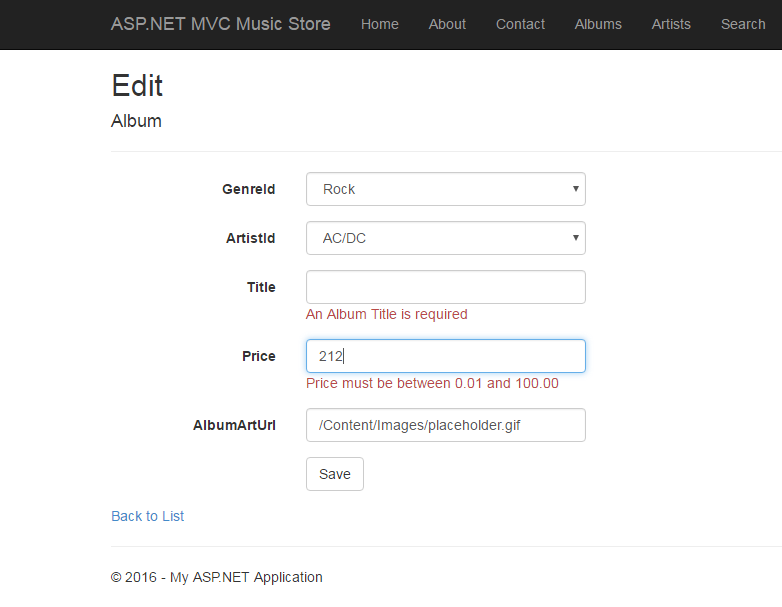
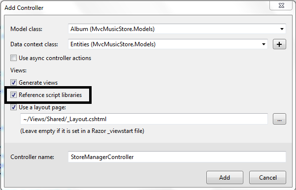
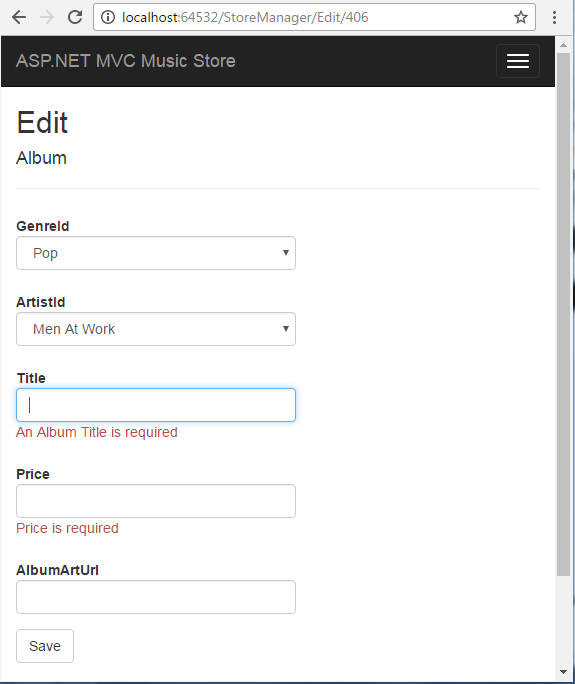

### MODULE 9 </br>BUILDING RESPONSIVE PAGES IN ASP.NET MVC 5 </br> WEB APPLICATIONS

#### LAB 9-VALIDATING USER DATA INPUT
**Estimated time to complete this lab: 45 minutes**

jQuery is one of the most popular JavaScript libraries in existence, and remains an open source project. Microsoft supports jQuery, and the project template for ASP.NET MVC will place all the files you need in order to use jQuery into a Scripts folder when you create a new MVC project. In MVC 5, the jQuery scripts are added via NuGet, meaning you can easily upgrade the scripts when a new version of jQuery arrives.
jQuery excels at finding, traversing, and manipulating HTML elements inside an HTML document. After you've found an element, jQuery also makes it easy to wire up event handlers on the element, animate the element, and build Ajax interactions around the element. This lab begins looking at these capabilities by discussing the gateway to jQuery functionality: the jQuery function.
In this lab, you will use jQuery for validating user data input.

#### Lab Objectives
After completing this lab, you will be able to:

- Validate client input
- Validate client input  usingjQuery
- Implement  validation  function  into user interface components

#### Lab Procedures
**A.	Validating  Client Input**
Client validation for data annotation attributes is on by default with the MVC framework. Follow these steps to explore and implement jQuery that used for validating user input:

1.	Open the Album class from Models folder in Solution Explorer and look at the Title and Price:

      ``` cs
      [Required(ErrorMessage= "An Album Title isrequired")]
      [StringLength(160)]
      public string Title { get; set; }

      [Required(ErrorMessage = "Price is required")]
      [Range(0.01, 100.00, ErrorMessage = "Price must	be between 0.01 and 100.00")]
      public decimal Price { get; set; }
      ```

 2.	Run the application and try to click **Save** button without fill the form.
 
      

      The data annotations make these properties required, and also put in some restrictions on the length and the range of the values the properties hold. The model binder in ASP.NET MVC performs server side validation against these properties when it sets their values. These built-in attributes also trigger client-side validation. Client-side validation relies on the jQuery Validation plugin.

**B.	Validating Client Input using jQuery**
As mentioned earlier, the jQuery Validation plugin (jquery.validate) exists in MVC 5 application by default. Follow these steps to validate user data input using jQuery:

1.	The easiest way to include this script reference is to make sure you select the Reference script libraries checkbox when you scaffold a  new controller, as shown in the following figure.

      
 
 2.	Add this plugin into any view in your application simply by adding the same script block you just saw at the bottom of the Login.cshtml view:

      ``` cs
      @section Scripts {
            @Scripts.Render("~/bundles/jqueryval")
      }
      ```

3.	Activate unobtrusive JavaScript and client-side validation features within web.config (you can find this file in the root of project within Solution  Explorer) settings as shown in the following  script.
      
      ``` xml
      <appSettings>
            <add key="ClientValidationEnabled" value="true"/>
            <add key="UnobtrusiveJavaScriptEnabled" value="true"/>
      </appSettings>
      ```
      If you want to turn off either feature throughout the application, you can change either setting to false.

**C. Implementing Validation Function into UserInterface Components**

jQuery Validation implements all the logic needed to hook into events (like submit and focus events) and execute client-side validation rules. The plugin provides a rich set of default validation rules. Follow these steps to implement the validation rules into UI (*User Interface*) component within your ASP.NET MVC 5 web applications:

1.  Open the `Edit.cshtml` view of `StoreManager` controller.

2.	Update the script for `Title` and `Price` fields with the following scripts.

      ``` html
      <p>
            @Html.LabelFor(model => model.Title)
            @Html.EditorFor(model => model.Title)
            @Html.ValidationMessageFor(model => model.Title)
      </p>

      <p>
            @Html.LabelFor(model => model.Price)
            @Html.EditorFor(model => model.Price)
            @Html.ValidationMessageFor(model => model.Price)
      </p>
      ```

      The `TextBoxFor` helper is the key. The helper builds out inputs for a model based on metadata. When `TextBoxFor` sees validation metadata, such as the `Required` and `StringLength` annotations on Price and Title, it can emit the metadata into the rendered HTML. The following markup is the editor for the `Title` property:

      ``` html
      <input data-val="true" 
            data-val-length="The field Title must be a string with a maximum length of 160." 
            data-val-length-max="160" data-val-required="An Album Title is required" 
            id="Title" name="Title" type="text" value="Greatest Hits"/>
      ```

      You see data dash attributes. It's the responsibility of the `jquery.validate.unobtrusive`  script to find elements with this metadata (starting with `data-val:"true"`) and to interface with the jQuery Validation plugin to enforce the validation rules expressed inside the metadata.
      jQuery Validation can run rules on every keypress and focus event, giving a user instant feedback on erroneous values. The validation plugin also blocks form submission when errors are present, meaning you don't need to process a request doomed to fail on the server (see the following figure).

      
