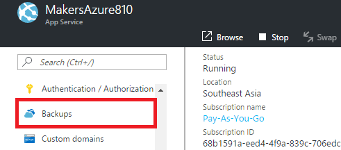
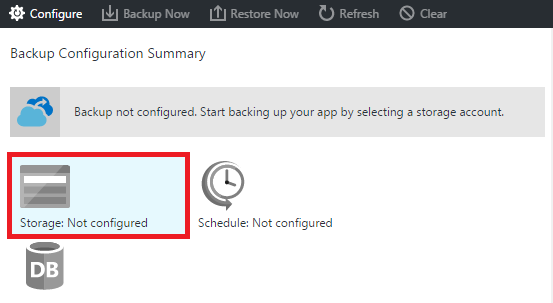
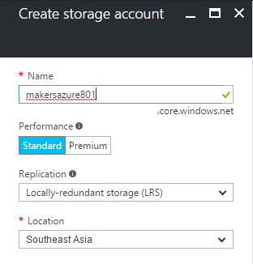
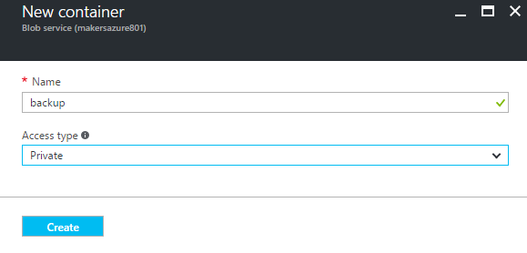
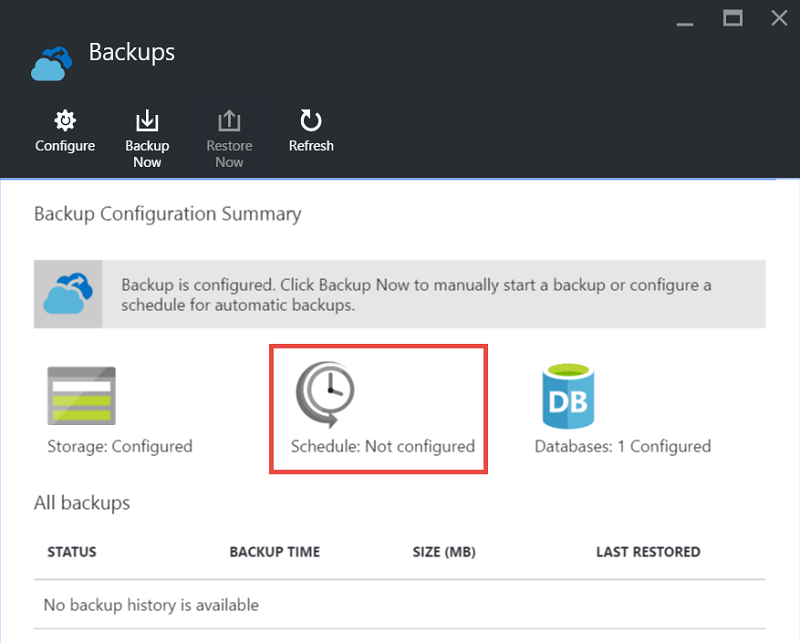
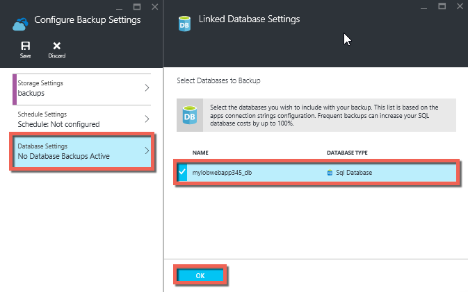

# MODULE 17  BACKUP WEB APPS IN AZURE

## LAB 02- BACKUP WEB APPS IN AZURE

__Estimated time to complete this lab: 30 minutes__

This lab explains how to blablabla.

### Lab Objectives

After completing this lab, you will be able to:

- Backup app configuration
- Backup file content
- Backup any databases connected to your app

### Lab Procedures

__A.	Create a manual backup__

Follow these steps to create a manual backup:

1. In the [Azure Portal](https://portal.azure.com/), navigate to your app's blade, select __Settings__, then __Backups__. The __Backups__ blade will be displayed.

    
    
2. In the __Backups__ blade, click __Storage: Not configured__ to configure a storage account.

    

3. Choose your backup destination by selecting a __Storage Account__ and __Container__. The storage account must belong to the same subscription as the app you want to back up. If you wish, you can create a new storage account or a new container in the respective blades. When you're done, click __Select__.

	
	
	Create Storage Account
	
	
	
	Create Container

    

4. In the __Configure Backup Settings__ blade that is still left open, click __Database Settings__, then select the databases you want to include in the backups (SQL database or MySQL), then click __OK__.

    

    > __Notes__
    > For a database to appear in this list, its connection string must exist in the __Connection strings__ section of the __Application settings__ blade for your app.

5. In the __Configure Backup Settings__ blade, click __Save__.

6. In the command bar of the __Backups__ blade, click __Backup Now__.

    
    
    You will see a progress message during the backup process.
    
    After you have configured a storage account and container for backups, you can make a manual backup at any time.

__B.	Configure automated backups__

1. In the __Backups__ blade, click __Schedule: Not configured__.

    

2. On the __Backup Schedule Settings__ blade, set __Scheduled Backup__ to __On__, then configure the backup schedule as desired and click __OK__.

   
    
3. In the __Configure Backup Settings__ blade that is still left open, click __Storage Settings__, then choose your backup destination by selecting a __Storage Account__ and __Container__. The storage account must belong to the same subscription as the app you want to back up. If you wish, you can create a new storage account or a new container in the respective blades. When you're done, click __Select__.

    
    
4. In the __Configure Backup Settings__ blade, click __Database Settings__, then select the databases you want to include in the backups (SQL database or MySQL), then click __OK__.

    

    > __Notes__
    > For a database to appear in this list, its connection string must exist in the __Connection strings__ section of the __Application settings__ blade for your app.
    
5. In the __Configure Backup Settings__ blade, click __Save__.

'Kata penutup dan kesimpulan'.
